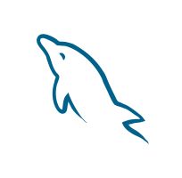
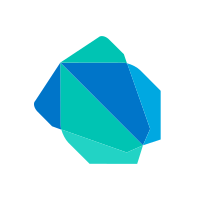
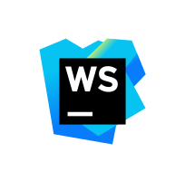

<h1 align="center">Hi there! 👋 I'm DIDAR HOSSAIN</h1>

  

## 🌟 About Me  
I'm a passionate **Full Stack Developer** with experience in designing, developing, and deploying web applications. I love building efficient and scalable solutions that solve real-world problems.

- 🖥️ Building secure, scalable, and modern systems.
- 🌐 Working with **Next.js**, **React JS**, **Node JS**, and more.
- 🔒 Passionate about **Website Building**, **Graphics** and **Social Media**.
- 🚀 Exploring **LangChain**, **OpenAI**, and **IoT systems**.

 

  
  
  
  
  

 

---

## 🛠️ Tech Stack  

  
  
  
  
  
  
  
  
  
  
  
  
  

### Favourite Tools

---

## 🌟 GitHub Stats  

<table>
<tbody>

<tr>
<td>

</td>

<td>

</td>
</tr>

</tbody>
</table>

---

  🚀 **Thank you for visiting my profile! Let's collaborate and build amazing things together!** 🚀

